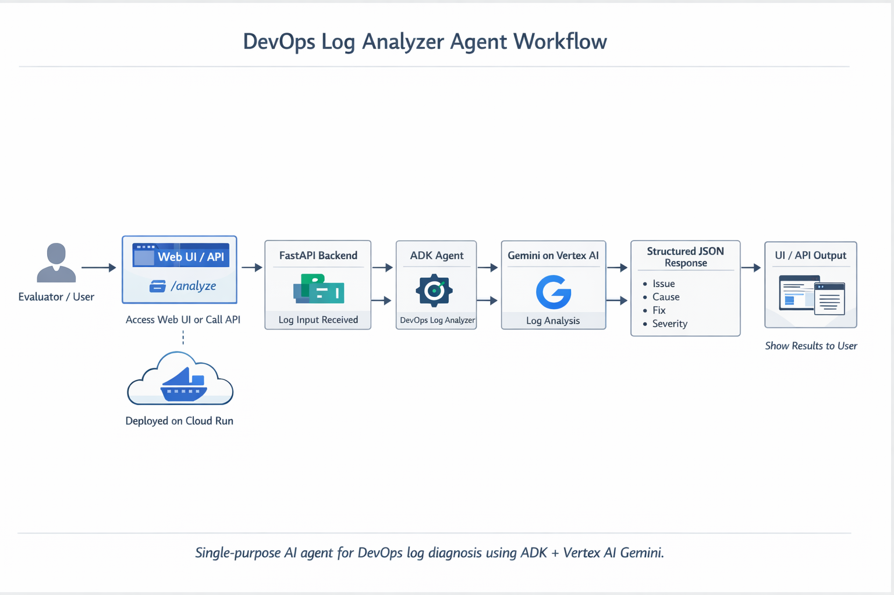

# DevOps Log Analyzer Agent


DevOps Log Analyzer Agent is a single-purpose AI agent built for the GenAI Academy APAC Edition project requirement:

> Build and deploy one AI agent using ADK and Gemini, host it on Cloud Run, expose it over HTTP, and make it perform one clearly defined task.

This project focuses on one job only: take a DevOps or infrastructure log and return a structured diagnosis with:

- `issue`
- `cause`
- `fix`
- `severity`

It also includes a browser UI on `/` so evaluators can test the project instantly without Postman or curl.

## What This Project Does

The agent analyzes logs from common DevOps scenarios such as:

- Kubernetes pod failures
- container crash loops
- OOMKilled events
- image pull problems
- network and service connectivity errors
- readiness and liveness probe failures
- deployment and CI/CD issues

The response is intentionally structured so it is easy to read in the UI and easy to consume from the API.

## Features

- Single ADK agent for one clearly defined task
- Gemini inference through Vertex AI
- Responsive browser UI for evaluator-friendly testing
- Public HTTP API via `POST /analyze`
- Structured JSON output with `issue`, `cause`, `fix`, and `severity`
- Health endpoint at `GET /health`
- Dockerized for Cloud Run deployment
- WSL-friendly local development setup

## Why This Project Stands Out

- It focuses on one practical DevOps workflow instead of acting like a generic chatbot
- It returns structured output, which makes the result easy to test and easy to understand
- It supports both browser-based evaluation and direct API usage
- It demonstrates a complete path from prompt design to real cloud deployment

## Tech Stack

- Python
- Google ADK
- Gemini on Vertex AI
- FastAPI
- Pydantic
- Uvicorn
- HTML, CSS, JavaScript
- Docker
- Google Cloud Run
- Google Cloud Build
- Artifact Registry

## Architecture

Flow:

1. User opens the web UI on `/` or calls `POST /analyze`
2. FastAPI validates the request
3. The ADK agent sends the log to Gemini on Vertex AI
4. The model returns a structured response
5. The API returns JSON and the UI renders the result

Main routes:

- `GET /` -> browser UI
- `GET /health` -> health check
- `POST /analyze` -> log analysis API




## Project Structure

```text
.
|-- app/
|   |-- agent.py          # ADK agent + Vertex AI configuration
|   |-- main.py           # FastAPI app and routes
|   |-- prompt.py         # system instruction for the agent
|   |-- schemas.py        # request/response models
|   `-- static/           # browser UI assets
|-- Dockerfile
|-- requirements.txt
`-- README.md
```

## Pre-Build Requirements

Before running or deploying the project, make sure these are ready:

### Local Environment

- Windows with WSL enabled
- Ubuntu in WSL
- Python 3.10+ available in WSL
- Google Cloud SDK installed in WSL
- Authenticated Google Cloud CLI
- Application Default Credentials configured for Vertex AI

Recommended auth steps inside WSL:

```bash
gcloud auth login
gcloud auth application-default login
```

### Google Cloud Project Requirements

- A Google Cloud project
- Billing enabled
- Vertex AI API enabled
- Cloud Run API enabled
- Cloud Build API enabled
- Artifact Registry API enabled
- Cloud Storage API enabled

Enable them with:

```bash
gcloud services enable \
  aiplatform.googleapis.com \
  run.googleapis.com \
  cloudbuild.googleapis.com \
  artifactregistry.googleapis.com \
  storage.googleapis.com
```

## Environment Variables

This project is now Vertex-only.

Create a `.env` file in the project root with:

```env
GOOGLE_GENAI_USE_VERTEXAI=True
GOOGLE_CLOUD_PROJECT=devops-log-analyzer-491520
GOOGLE_CLOUD_LOCATION=global
GEMINI_MODEL=gemini-2.5-flash
```

Notes:

- `GOOGLE_CLOUD_PROJECT` is required
- `GOOGLE_CLOUD_LOCATION=global` works for this project
- `GEMINI_MODEL=gemini-2.5-flash` is the model currently used by the app

## Run Locally

Use WSL for local development.

```bash
cd /path/to/project
python3 -m venv .venv
source .venv/bin/activate
pip install -r requirements.txt
uvicorn app.main:app --reload
```

Open:

- `http://127.0.0.1:8000/`

## Test Locally

### Browser UI

Open the root page and paste a log directly into the UI.

### Curl Test

```bash
curl -X POST http://127.0.0.1:8000/analyze \
  -H "Content-Type: application/json" \
  -d '{"log":"CrashLoopBackOff in pod payment-api due to invalid startup command"}'
```

Example response:

```json
{
  "issue": "Pod in CrashLoopBackOff state",
  "cause": "The container's startup command is invalid or misconfigured, causing the application to fail on launch.",
  "fix": "Review the container image's entrypoint and command in the pod definition and correct the invalid startup command.",
  "severity": "Critical"
}
```

## Deploy To Cloud Run

### 1. Set the active project

```bash
gcloud config set project devops-log-analyzer-491520
```

### 2. Create a runtime service account

```bash
gcloud iam service-accounts create cloud-run-vertex-sa \
  --display-name="Cloud Run Vertex runtime"
```

### 3. Grant Vertex AI access to the runtime service account

```bash
gcloud projects add-iam-policy-binding devops-log-analyzer-491520 \
  --member="serviceAccount:cloud-run-vertex-sa@devops-log-analyzer-491520.iam.gserviceaccount.com" \
  --role="roles/aiplatform.user"
```

### 4. Important source-build permissions

When using `gcloud run deploy --source`, the build may run as the Compute Engine default service account.

In this project, successful deployment required:

- `roles/storage.objectViewer` on the `run-sources-...` bucket for:
  - `642800067956-compute@developer.gserviceaccount.com`
  - `642800067956@cloudbuild.gserviceaccount.com`
- `roles/artifactregistry.writer` on the `cloud-run-source-deploy` repository for:
  - `642800067956-compute@developer.gserviceaccount.com`
- `roles/logging.logWriter` on the project for:
  - `642800067956-compute@developer.gserviceaccount.com`

If your deployment fails during upload/build/push, check these first.

### 5. Deploy

```bash
gcloud run deploy devops-log-analyzer \
  --source . \
  --region us-central1 \
  --allow-unauthenticated \
  --service-account cloud-run-vertex-sa@devops-log-analyzer-491520.iam.gserviceaccount.com \
  --set-env-vars GOOGLE_GENAI_USE_VERTEXAI=True,GOOGLE_CLOUD_PROJECT=devops-log-analyzer-491520,GOOGLE_CLOUD_LOCATION=global,GEMINI_MODEL=gemini-2.5-flash
```

## Verify Deployment

```bash
SERVICE_URL=$(gcloud run services describe devops-log-analyzer \
  --region us-central1 \
  --format='value(status.url)')

echo "$SERVICE_URL"
```

You can then test:

```bash
curl -X POST "$SERVICE_URL/analyze" \
  -H "Content-Type: application/json" \
  -d '{"log":"OOMKilled container in Kubernetes deployment"}'
```

## Supported Log Categories

Best-fit inputs include:

- Kubernetes logs
- Docker/container runtime logs
- service startup failures
- deployment failures
- networking and port-binding issues
- readiness/liveness probe failures
- memory/resource exhaustion issues

Less reliable inputs include:

- unrelated business-domain logs
- logs with no operational context
- highly specialized security-forensics traces

## UI Notes

The UI is designed for evaluators to test quickly:

- sample log buttons for instant demos
- large input area for pasted logs
- one-click analyze flow
- formatted response cards
- raw JSON viewer
- severity highlighting
- responsive layout for laptop and mobile screens

## Why Vertex AI Instead of API Key-Based Gemini

The final project uses Vertex AI for a cleaner Google Cloud deployment path:

- no embedded API key required at runtime
- Cloud Run authenticates using a service account
- model access is controlled through IAM
- easier alignment with Cloud Run and GCP infrastructure

## Submission Summary

- Track: ADK
- Agent type: Single-purpose DevOps log analysis agent
- Hosting: Cloud Run
- Model: Gemini on Vertex AI
- Endpoint: `POST /analyze`
- Browser UI: `GET /`

## License

This project is intended for learning, evaluation, and project submission purposes.
